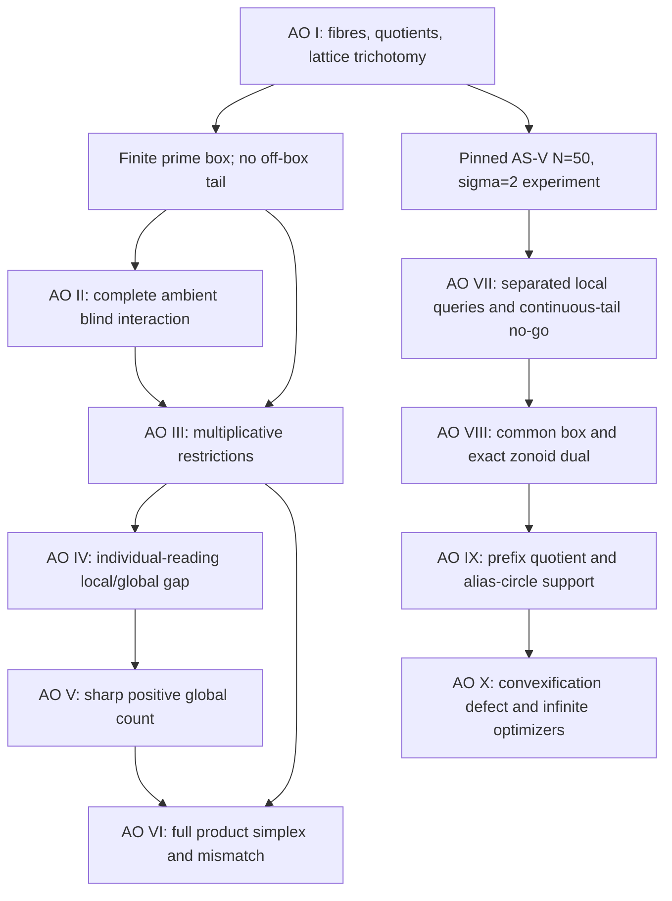

# Arithmetic Observability Atlas

## A master synthesis of definitions, models, theorems, geometry, and evidence

- **Status:** synthesis of Arithmetic Observability I--X; not peer reviewed
- **Date:** 15 August 2026
- **Scope:** the declared finite harmonic protocols, finite prime-box models,
  bounded product models, and degree-fourteen coefficient-envelope models in
  the ten companion manuscripts

This atlas states what the Arithmetic Observability series proves as one
theory.  It is an index and scope contract, not an eleventh source of stronger
claims.  When a compressed statement here and a theorem in a numbered
manuscript differ, the hypotheses and conclusion of the numbered theorem are
authoritative.

---

## 1. The common question

An arithmetic-observability problem consists of five declared objects:

1. an arithmetic model class `M`;
2. a feature map `Phi:M->X`;
3. a global harmonic protocol into a normed data space `Y`;
4. a nuisance or tail model; and
5. a local query `Q:M->Z` together with a query loss.

After all allowed nuisances are included, object `m` has a noiseless response
fibre

\[
 \mathcal F_m\subseteq Y.
 \tag{1.1}
\]

The pairwise fibre separation is

\[
 \Delta(m,m')=\operatorname{dist}(\mathcal F_m,\mathcal F_{m'}).
 \tag{1.2}
\]

The operational question is not merely whether `Phi` or the harmonic map is
injective.  It is whether every data-compatible pair has the same requested
query, and how rapidly query ambiguity grows with data noise.

The series keeps three obstructions separate:

- **representation:** `Phi(m)=Phi(m')` for different arithmetic objects;
- **acquisition:** the harmonic protocol collapses different features; and
- **nuisance:** an allowed tail or calibration direction cancels a target
  distinction.

No acquisition theorem can repair a representation collision.  Conversely,
an injective feature map does not prevent acquisition or nuisance aliases.

---

## 2. Equivalence, confusability, and stability

The following terms are used deliberately.

### 2.1 Deterministic observational equivalence

For a deterministic effective observation `O:M->Y`,

\[
 m\sim_O m'\quad\Longleftrightarrow\quad O(m)=O(m').
 \tag{2.1}
\]

This is an equivalence relation.  In the linear common-nuisance model

\[
 y=Hx+Bz+\eta,
 \qquad A=P_{(\operatorname{ran}B)^\perp}H,
 \tag{2.2}
\]

it is exactly

\[
 x\sim_A x'\quad\Longleftrightarrow\quad A(x-x')=0.
 \tag{2.3}
\]

The induced pseudometric is `d_A(x,x')=||A(x-x')||`; it is a metric on
`X/ker A`.

### 2.2 Fibre confusability

For set-valued responses, zero-noise confusability means

\[
 \mathcal F_m\cap\mathcal F_{m'}\ne\varnothing.
 \tag{2.4}
\]

This relation is symmetric and reflexive but need not be transitive, so the
series does not call it an equivalence relation in full generality.  Equality
of complete response fibres is a genuine but stronger equivalence relation.

If the two fibres are compact, (2.4) is equivalent to `Delta(m,m')=0`.
With closed adversarial noise balls of radius `epsilon`, two compact fibres
are confusable exactly when

\[
 \Delta(m,m')\le 2\varepsilon.
 \tag{2.5}
\]

The midpoint of a closest pair supplies the matching two-object obstruction.

### 2.3 Query identifiability

The query is exactly identifiable when every confusable pair has the same
query value:

\[
 \mathcal F_m\cap\mathcal F_{m'}\ne\varnothing
 \quad\Longrightarrow\quad Q(m)=Q(m').
 \tag{2.6}
\]

In the linear model with query `Lx`, this is the exact kernel condition

\[
 \ker A\subseteq\ker L.
 \tag{2.7}
\]

It is equivalent to the factorization `L=RA` on `ran A`.  Arithmetic
Observability I proves the exact adversarial minimax identity

\[
 R^*(\varepsilon)=\|R\|\varepsilon.
 \tag{2.8}
\]

If (2.7) fails on an unbounded linear target class, zero-noise minimax error
is infinite.  For general fibres, the series uses the pairwise query modulus

\[
 \omega_Q(\varepsilon)
 =\frac12\sup\{\|Q(m)-Q(m')\|:\Delta(m,m')\le2\varepsilon\}
 \tag{2.9}
\]

as a universal lower obstruction; an exact upper identity requires the
additional structure stated in the relevant manuscript.

### 2.4 Arithmetic lattice trichotomy

For a lattice `Lambda` and linear observation `A`, exactly one regime holds:

1. `ker A` contains a nonzero lattice point: exact collision;
2. `A` is lattice-injective but has real rank below the lattice rank: exact
   infinite-precision identification with zero uniform separation; or
3. `A` has full real rank on the lattice span: a separated image lattice and
   exact nearest-image radius `delta/2`.

This is the basic reason integrality can restore identification without
restoring stability.

---

## 3. Model and manuscript map

The ten papers form two branches joined by the framework in Arithmetic
Observability I.  They are not ten successive enlargements of one source
class.



### 3.1 Finite-prime-box branch

For distinct known primes and exponents `0,...,s-1`, the ambient tensor has
dimension `s^r`.

- **AO I:** resonant blocks recover complementary valuation marginals.  The
  full ANOVA interaction has dimension `(s-1)^r` and is exactly blind.
- **AO II:** ordinary nonresonant traces complete that ambient blind space.
  The sharp generic threshold is `(s-1)^r` complex readings for complex
  coefficients and `ceil((s-1)^r/2)` for real coefficients.
- **AO III:** on multiplicative sources the relevant set is the model secant,
  not the ambient vector space.  Two complementary margins recover every
  normalized product and every positive free-scale geometric tensor.
- **AO IV:** individual readings give generic-local recovery before they give
  global recovery.  The local thresholds are `r+1` over the complex
  parameter space and `ceil((r+1)/2)` on the positive-real model.
- **AO V:** the positive free-scale geometric model has the exact global
  complexity `r`; a phase-separated schedule attains it and Borsuk--Ulam
  rules out every smaller schedule.
- **AO VI:** the larger labelled product-simplex model has the exact global
  complexity `r floor(s/2)`.  It also supplies exact response-tube,
  quotient-secant, and tangent--kernel mismatch geometry.

The inclusions are model restrictions, not assertions about arbitrary number
fields.  After normalization, the one-parameter positive geometric factors
form a submodel of the full product simplex, which is itself a nonlinear
subset of the ambient coefficient tensor space.

### 3.2 Degree-fourteen tail branch

This branch fixes the Arithmetic Sensing V weighted experiment at cutoff
`N=50`, vertical exponent `sigma=2`, and its certified 8,900-node measure.

- **AO I:** converts the earlier reconstruction certificate into a first
  all-prefix fibre-separation bracket.
- **AO VII:** proves a strong four-anchor theorem for unit-spaced labels and
  the opposite continuous-query no-go when independent tail intervals span
  the finite data space.
- **AO VIII:** uses the shared coefficient box.  Its width, rather than twice
  its radius about zero, controls fibre differences.  The continuous tail is
  a compact zonoid with an exact support-function dual.
- **AO IX:** profiles every real nonquery-prefix direction before the tail
  optimization and exploits the exact odd-tenth alias circle to certify the
  remote support.
- **AO X:** proves that the quotient is exactly the convex hull of the legal
  independent-integral nuisance responses, identifies the remaining
  arithmetic defect, bounds the exceptional continuous face, and proves that
  every positive-distance optimizer has infinite tail support.

The source classes satisfy, at the coefficient-envelope level,

\[
 \text{arithmetically realizable}
 \qquad\subseteq\qquad
 \text{independent integral envelope}
 \qquad\subseteq\qquad
 \text{continuous coefficient box}.
 \tag{3.1}
\]

The first inclusion is only a scope relation: the corpus does not characterize
the left-hand set.  In the finite data space, the continuous tail response is
the convex hull of the independent-integral tail responses.  Equality of
convex hulls does not imply equality of nearest points.

---

## 4. Reconstruction and obstruction pairs

The principal positive theorems have explicit negative counterparts.

| Setting | Reconstruction or stability theorem | Matching obstruction or boundary |
|---|---|---|
| Linear query with unrestricted common subspace | `ker A subset ker L`; exact minimax radius `||R|| epsilon` (AO I, Thm. 2.3) | A kernel direction with nonzero query gives infinite zero-noise error; the least-observable direction gives the exact two-point lower bound |
| Integer lattice | Full real rank gives a separated image lattice and radius `delta/2` (AO I, Thm. 3.1) | Integer kernel gives collision; lower real rank with no integer kernel gives separation zero |
| Ambient prime-box interaction | `k=(s-1)^r` complex or `ceil(k/2)` real completion readings are generically sufficient (AO II, Thms. 3.1 and 4.1) | Rank--nullity makes every smaller schedule fail; bad threshold schedules can still have arbitrarily small floor |
| Positive geometric factors | A designed `r`-reading schedule is globally injective with a phase inverse modulus (AO V, Thms. 3.2 and 4.1) | Every schedule with fewer than `r` readings has reciprocal collisions on every log-radius sphere (AO IV, Thm. 4.1; AO V, Thm. 4.2) |
| Labelled product simplex | `r floor(s/2)` DFT-isolating readings give a global raw secant floor (AO VI, Thms. 3.2 and 4.2) | Reflection plus Borsuk--Ulam gives exact collisions for every smaller schedule (AO VI, Thm. 4.1) |
| Unit-spaced local query under bounded tails | Width-aware rows give exact identification and a positive radius (AO VII, Thm. 2.1; AO VIII, Thm. 3.1) | A continuous query collapses under every positive full-dimensional continuous-tail scale (AO VII, Thm. 8.1 and Cor. 8.2) |
| Four-anchor degree-fourteen query | Uniform quotient lower radius `0.019991343027394314...` (AO IX, Cor. 2.4 and Eq. 9.5) | A legal eleven-mode independent-integral response gives upper radius `0.019999999997766001...` (AO X, Sec. 8.1) |
| Continuous versus integral nuisance | Equality holds exactly when the convex projection is integrally realizable (AO X, Thms. 3.3 and 4.1) | Explicit prefix-only and tail-only models have strict convexification gaps (AO X, Sec. 4.1); equality in the pinned model remains open |

The last numerical pair is near-matching, not an equality theorem.  Its two
endpoints apply to both the continuous box and independent-integral envelope,
but they do not prove that the two exact radii coincide.

---

## 5. Distinguishability geometries

There is no protocol-independent arithmetic metric in the series.  Each
geometry is induced jointly by a source class, observation map, nuisance
model, and norm.

| Geometry | Exact object | Principal result |
|---|---|---|
| Linear quotient | `d_A(x,x')=||A(x-x')||` | Metric on `X/ker A`; generalized Gram floor is the reciprocal squared minimax amplification |
| Prime-valuation ANOVA | `G_w=sum_j w_jP_j` | Spectrum `lambda_S=sum_{j notin S}w_j`; full interaction is the kernel; uniform weights are E-optimal (AO I) |
| Multiplicative pullback | Marginal metric restricted to the product manifold | At the uniform product, factor `j` has generalized eigenvalue `1-w_j` with multiplicity `s-1` (AO III) |
| Compact positive shape | Pullback of the torus phase metric to `y_j=u_j/(1+u_j)` | A phase-separated schedule globally dominates `||y-y'||_infinity`; no uniform analogue exists in global log coordinates (AO V) |
| Near-model quotient | `dist(p-p',ker H)` and tangent--kernel principal angles | Equal-radius source thickening erodes pairwise quotient separation by exactly `2rho`; `1/mu(p)` is the exact tangent minimax factor (AO VI) |
| Separated query lattice | Maximum of weighted discrete coordinate metrics | A genuine lower metric survives continuous unqueried coordinates and continuous bounded tails (AO VII) |
| Common-tail zonoid | `dist(Ah,Z)` and its support dual | Exact primal, exact dual, KKT signs, and finite/remote certificates (AO VIII--IX) |
| Arithmetic defect | Distance from the convex projection to the integral response set | `sqrt(delta_Q^2+eta^2) <= delta_Z <= delta_Q+eta`; equality iff the projection is integral (AO X) |

These constructions explain why exact identification, stable recovery, and
object identity can disagree without contradiction.

---

## 6. Norm and scale dictionary

| Context | Data/source convention | Meaning of the reported scale |
|---|---|---|
| AO I common-subspace theorem | Declared finite-dimensional Hilbert norms | `epsilon` is a data-noise radius; `kappa epsilon` is exact minimax query error |
| AO I and AO III calibrated margins | `R_j=s^{-1/2}M_j`, direct-sum weights `w_j` | This is a calibrated marginal norm, not iid raw-trace noise |
| AO II complete raw design | Complex readings realified isometrically; equal-weight RMS over 62 rows | The certified raw Gram floor refers to that RMS normalization |
| AO IV--V geometric factors | Exact complex values; phase uses torus `l_infinity`; raw bound uses reading `l_infinity` | Shape is measured in compact `y`; the absolute raw bound carries `min(C,C')` |
| AO VI product simplex | Unnormalized row `l2`; Euclidean factor and tensor norms | The displayed secant floors use the six-row norm; quotient mismatch uses the source-induced quotient norm |
| AO VII--X AS-V model | `Y=L^2(mu;C)` realified, `||c_n||=1`, `Ae_n=c_n/n^2` | A fibre **distance** is twice its adversarial critical **radius** |
| AO IX--X nonquery prefix | Normalized synthesis coefficient `alpha_j=p_j/j^2` | Bounds on `alpha` must be multiplied by `j^2` before applying prefix integrality |
| AO VIII--X tail | Coefficient range `[-d_14(k),d_14(k)]`; response amplitude `d_14(k)/k^2` | Continuous coefficients, independent integers, and realizable arithmetic sequences are distinct models |

Complex observation spaces are realified without changing their norm whenever
the nuisance coefficients are real.  Support functions then use
`Re <u,v>`.  A complex-coefficient relaxation would require additional
quadrature controls and is not silently included.

---

## 7. Requirement-to-evidence matrix

The corpus manifest records the same mapping under the payload key
`goal_requirement_evidence`.

| First-theory requirement | Authoritative mathematical evidence | Nontrivial certified evidence |
|---|---|---|
| Precise definitions | AO I Secs. 1--3: objects, fibres, query identifiability, quotient equivalence, minimax stability, lattice trichotomy | Exact schemas and adversarial mutation tests across all eleven packages; bounded strict parsers in the later packages |
| General observability framework | AO I Thm. 2.3 and Thm. 3.1; AO VI Thms. 6.1--6.2 for response tubes; AO VIII Thms. 2.1--4.2 for common compact nuisances | Prime-box and AS-V bridge artifacts |
| Substantial reconstruction theorem | AO V Thm. 4.2: exact positive global count `r`; AO VI Thm. 4.2: exact product-simplex count `r floor(s/2)` | Canonical `(2,3,5),s=4` schedules in the global-design and full-Segre certificates |
| Matching obstruction or lower bound | Reciprocal/reflection Borsuk--Ulam collisions in AO IV--VI; lattice crowding in AO I; continuous-tail no-go in AO VII | Certified bad acquisition chamber in AO V and six-mode collapse in AO VII |
| Exact observational equivalence | Kernel quotient in AO I; response-set overlap in AO VI; quotient-zonoid membership in AO IX; convex versus integral membership in AO X | Exact rational and interval witnesses in the associated packages |
| Quantitative stability | Exact `kappa epsilon` identity in AO I; global phase and raw secant floors in AO V--VI; four-anchor bracket in AO IX--X | Raw Gram, phase-box, fine-grid Mellin, rank-11, and localization certificates |
| Explicit distinguishability geometry | ANOVA spectrum (AO I), product pullback (AO III), compact phase metric (AO V), quotient/tangent geometry (AO VI), zonoid and arithmetic defect (AO VIII--X) | Exact 64-dimensional prime-box geometry and degree-fourteen query geometry |
| Falsifiability and scope | Every manuscript has a proved/computed/open ledger and explicit countermodels | Canonical JSON, pinned payload digests, deterministic regeneration, hostile mutation tests, and one declared opt-in large rebuild |

This matrix establishes the requested first complete theory for the declared
models.  It does not establish a universal recovery theorem for all
arithmetic objects or all incomplete harmonic protocols.

---

## 8. Manuscript, package, and dependency table

| Paper | Principal model/result | Certificate schema and payload SHA-256 | Logical or formal dependencies |
|---|---|---|---|
| I | General kernel; prime-box ANOVA; first AS-V fibre bridge | `arithmetic-observability-prime-box-v1`, `3fe7461250815719b4e80c9ad73dc04325f7fb13e8fa0dd83f0906c9505dcc56`; `arithmetic-observability-asv-fibre-bridge-v1`, `bf2e02334d9e2f68942d7ffba394d213c514ddf30c4db0ca277a3263adc8cd58` | Operational Information Geometry; pinned AS-V source for the bridge |
| II | Minimal ambient harmonic completion | `arithmetic-observability-harmonic-completion-v1`, `9692367b6b1ad26e713e2da4684726ccc43a9b1b3747f8e1e5f368ad74c70b6a` | AO I kernel and prime box |
| III | Multiplicative and normalized-product restriction | `arithmetic-observability-normalized-product-v1`, `5805a3f385a6b5a0728d38413c9a0cb76d15b59285f671021ff749a6c4ea6a24` | AO I--II |
| IV | Individual-reading local/global separation | `arithmetic-observability-reading-complexity-v1`, `4b652c09feb7d68c6eb10c143086c390ee5f48e7618aee694e174d513804ef8e` | AO III |
| V | Sharp positive global complexity and chambers | `arithmetic-observability-global-design-v1`, `ef58b99b5a1377878a7b9fd770c6a16fa5961bb46af40d74f0697e7f0454f2ab` | AO IV |
| VI | Full product simplex and mismatch tubes | `arithmetic-observability-full-segre-v1`, `02a00b4a1bb18ab366cd1de844f1f23101f5c3f424329b12e268d981b42179fc` | AO I, III--V; its artifact also binds the VI manuscript hash |
| VII | Discrete queries and continuous-tail boundary | `arithmetic-observability-discrete-queries-v1`, `6dc2aa93d6919bd09928768ff6d5592782fdf2867cba50da039b4698be530996` | AO I; pinned AS-V source; AO V schedule is provenance for one self-contained finite witness |
| VIII | Common nuisance and zonoid duality | `arithmetic-observability-common-nuisance-v1`, `96b874899b16e4502d815627c7b722b9ba0332266fb30c8cd4d0579b48ca0cfd` | AO I, VII; pinned AS-V source |
| IX | Quotient zonoid and alias circle | `arithmetic-observability-alias-circle-v1`, `f97fb3a484bb4e598558b47d8217be05f31b63fe1925a854b43aecf216a66c6f` | AO I, VIII; pinned AS-V and Mellin/positivity proof objects |
| X | Convexification gap and infinite-support fibres | `arithmetic-observability-convexification-gap-v1`, `fec0b1e43893794839afb4503975ba4f51b0c9c9980e1e43b38710a690e7348c` | Hash-pinned AO VIII and IX packages plus pinned AS-V helper objects |

The corpus-level package uses the following fixed interface:

```text
arithmetic_observability_corpus.py
arithmetic_observability_corpus_manifest.json
test_arithmetic_observability_corpus.py
schema: arithmetic-observability-corpus-v1
```

Its purpose is to bind the ten manuscripts, eleven verifier/certificate/test
triplets, dependency graph, schemas, and stated scope in one place.  A corpus
manifest verifies file identity and evidence topology; it does not mechanize
the analytic proofs in the manuscripts.

---

## 9. Reproduction

Run the corpus verifier and its focused hostile tests:

```bash
python arithmetic_observability_corpus.py \
  arithmetic_observability_corpus_manifest.json
python -m unittest -q test_arithmetic_observability_corpus.py
```

Run the complete ordinary Arithmetic Observability regression:

```bash
python -m unittest discover -s . -p 'test_arithmetic_observability*.py' -q
```

Before adding the corpus-level hostile tests, the I--X package set ran 282
tests successfully, with one intentional opt-in skip: the full AO-IX
fine-grid reconstruction.  The discovery command is authoritative for the
current total after the corpus package is present.

Normal AO-IX verification checks every stored proof object and exact
consequence.  Rebuilding its large convolution and kernel tables requires the
pinned producer environment and is explicit:

```bash
python arithmetic_observability_alias_circle.py \
  --certificate arithmetic_observability_alias_circle_certificate.json \
  --recompute
```

The producer pins `python-flint 0.9.0`, `FLINT 3.6.0`, one FLINT thread,
`gmpy2 2.3.1`, and MPFR 4.2.2 for that reconstruction.  The committed full
build is memory- and time-intensive; ordinary verification is intentionally
cheap.

Several earlier packages report independent byte-identical Windows
regeneration.  The large AO-IX package and the dependent AO-X package have
not acquired a native Windows reconstruction in the current corpus.  Their
canonical JSON and raw-file hashes are LF-sensitive.  A Windows checkout with
`core.autocrlf=true` can reproduce the mathematics while failing a raw-byte
comparison; a byte-preserving transfer or LF checkout is required for the
stronger byte-identical claim.

---

## 10. Scope, nonclaims, and completion boundary

### Established for the declared models

- a general object/feature/observation/nuisance/query framework;
- exact quotient equivalence for linear common nuisances;
- exact minimax stability in the linear query model;
- the lattice collision/unstable-injective/stable trichotomy;
- exact global reconstruction counts with matching topological obstructions
  on two nontrivial prime-product models;
- exact response-tube and tangent mismatch geometry;
- separated local-query recovery under a bounded degree-fourteen tail;
- exact continuous common-tail primal and dual geometry;
- a formally certified near-matching four-anchor radius bracket;
- an exact convexification criterion for continuous--integral equality; and
- compact attainment together with the infinite-support obstruction.

### Not established

- characterization of the coefficient sequences realized by arbitrary
  number fields, automorphic forms, or Euler products;
- equality of the continuous and independent-integral closest fibres in the
  pinned degree-fourteen problem;
- an exact quotient optimizer, arithmetic-defect value, or closest integral
  tail sequence there;
- transfer of envelope witnesses to coupled number-field-realizable data;
- robustness to unknown primes, arbitrary clock error, or undeclared noise
  metrics;
- a universal statement for infinite Euler products, zeta zeros, the Riemann
  hypothesis, or physical law;
- peer review or historical priority for the programme-specific synthesis.

The requested **first complete theory** is therefore complete in the precise
sense supported by the evidence matrix: it has definitions, a general
framework, substantial reconstruction theorems, matching obstructions,
quantitative stability, exact equivalence criteria, and explicit induced
geometries on nontrivial arithmetic models.  The broader research programme
remains open at the arithmetic-realizability boundary and at the exact
continuous--integral optimizer.
