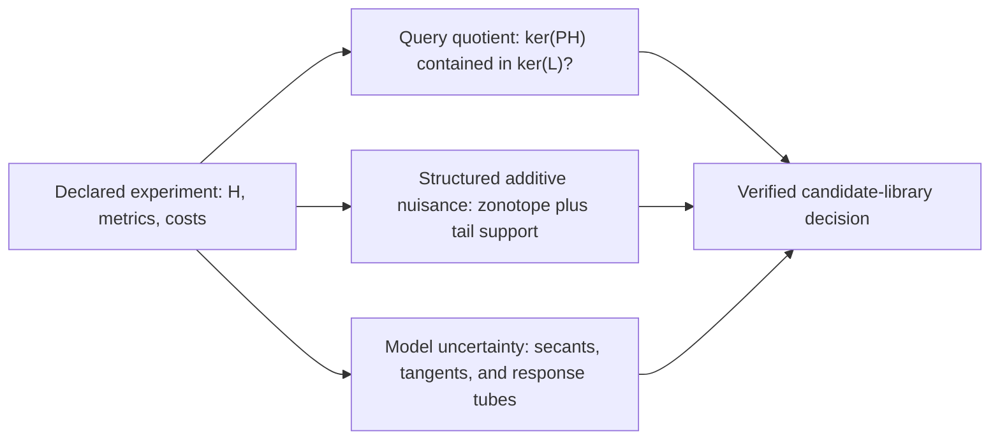

# Arithmetic-Atlas integration for the Operational Information Geometry protocol engine

## Query-directed design under structured nuisance and model uncertainty

- **Theory synthesis and implementation:** Codex (OpenAI)
- **Research programmes:** Operational Information Geometry and Arithmetic Observability
- **Date:** 15 August 2026
- **Status:** proved for the declared finite rational models; not peer reviewed

## 1. Result

The [Arithmetic Observability Atlas](ARITHMETIC_OBSERVABILITY_ATLAS.md)
supplies three ideas that materially strengthen the Operational Information
Geometry protocol engine:

1. observability is query dependent, so a protocol may recover \(Lx\) exactly
   even when it cannot recover the full state \(x\);
2. nuisance geometry must retain shared coefficients and correlations rather
   than replacing every uncertainty by an entrywise box; and
3. a positive ambient information floor does not by itself prove stability on
   a nonlinear model class or under perturbations of a nominally blind
   response direction.

The integrated engine turns those ideas into four proof-producing layers:

- an exact query quotient and minimax-amplification certificate;
- a finite candidate-library design certificate with shared- or
  independently-refit nuisance semantics;
- an exact structured-zonotope separation certificate with optional tail
  support bounds; and
- a model-aware quotient audit for finite secants, tangent spaces, response
  tubes, and uncertain nominal null directions.

Every theorem decision is made with exact rational algebra or an outward
bound accepted by exact \(LDL^T\). Floating point may help propose a witness,
but it is neither necessary for valid rational inputs nor trusted for a
certificate decision. The serialized reports contain their declarations and
witnesses and are rebuilt by strict standalone verifiers.

This is not a universal robust-design theorem. It is a composable certificate
architecture for declared finite models.

## 2. Why the uncertainty classes must remain separate

The integrated architecture uses three distinct mathematical objects.



An unrestricted common nuisance has the form \(Bz\) and is removed by a
linear quotient. A bounded correlated nuisance has the form

\[
 Z=\{Va: |a_j|\le d_j\}
\]

and is controlled by its support function. Response uncertainty changes the
operator \(H\) itself and can activate a direction in \(\ker H\). These
operations do not commute and cannot safely be merged into one generic
"noise" number.

In particular:

- profiling a nuisance shared across protocols does not generally commute
  with summing their information forms;
- replacing a correlated zonotope by an entrywise box can lose a decisive
  cancellation; and
- nominal query insensitivity to \(\ker H\) does not control uncertain leakage
  from an unbounded blind coordinate.

The APIs and report schemas therefore name these premises separately.

## 3. Exact query-directed observability

Consider

\[
 y=Hx+Bz+\eta,
 \qquad \|\eta\|_W\le\varepsilon,
\]

with source cost \(S\succ0\), output precision \(W\succ0\), requested query
\(Lx\), and query metric \(T\succ0\). Let \(B_0\) be any exact basis of
\(\operatorname{ran}B\), and define

\[
 P=I-B_0(B_0^TWB_0)^{-1}B_0^TW,
 \qquad A=PH.
 \tag{3.1}
\]

Exact multiplication checks \(P^2=P\), \(PB=0\), and \(P^TW=WP\).

### Theorem 3.1 — query identifiability

The query \(Lx\) is exactly determined by the nuisance-profiled data if and
only if

\[
 \ker A\subseteq\ker L.
 \tag{3.2}
\]

If (3.2) fails, the certificate returns an exact rational \(h\) with
\(Ah=0\) and \(Lh\ne0\). On an unbounded source class this proves infinite
zero-noise minimax query error.

If (3.2) holds, exact row reduction constructs a decoder \(D\) satisfying

\[
 DA=L,\qquad DH=L,\qquad DB=0.
 \tag{3.3}
\]

On exact quotient coordinates, let \(G\) be the data Gram and \(Q\) the query
form. Then

\[
 \kappa^2=\lambda_{\max}(Q,G)
 \tag{3.4}
\]

and the exact adversarial minimax error is

\[
 R^*(\varepsilon)=\kappa\varepsilon.
 \tag{3.5}
\]

The report brackets \(\kappa^2\) by an exact Rayleigh witness below and an
exact \(LDL^T\)-verified rational shift above. This answers a stronger and
more relevant question than full-state E-optimality: it measures only the
requested query on the observable quotient.

## 4. Protocol mixtures with nuisance semantics

Let protocol \(i\) have response \(H_i\), nuisance map \(B_i\), output
precision \(W_i\), cost \(c_i\), and budget share \(p_i\). Its physical weight
is \(\alpha_i=p_i/c_i\).

### 4.1 One nuisance shared across protocols

If the same \(z\) appears in every active protocol, the correct construction
is

\[
 H_{\rm stack}=\operatorname{vstack}(H_i),\qquad
 B_{\rm stack}=\operatorname{vstack}(B_i),\qquad
 W_{\rm stack}=\operatorname{blockdiag}(\alpha_iW_i),
 \tag{4.1}
\]

followed by one joint projection. The Schur complement couples protocols, so
the profiled information need not be linear in the mixture weights.

### 4.2 One nuisance independently refit per protocol

If each protocol has a separate \(z_i\), the nuisance map is block diagonal.
Then the exact profiled information does add:

\[
 G_{\rm profile}(p)
 =\sum_i\frac{p_i}{c_i}
 H_i^TW_iP_iH_i.
 \tag{4.2}
\]

This branch is compatible with ordinary linear information-form design.

The distinction is operationally large. In the pinned scalar control, each
protocol \(y_i=h_ix+z_i\) is useless under independent refitting, while the
pair \(y_1=x+z\), \(y_2=2x+z\) with one shared \(z\) identifies \(x\) and has
the exact lower certificate \(\kappa^2\ge4\).

## 5. Finite candidate-library design

The candidates must share an exact comparison contract: source dimension and
metric, query and query metric, and the meaning of the common data-noise
radius. For a declared finite family satisfying that contract, each candidate
receives an exact status:

- unidentifiable, with a kernel witness;
- an exactly zero query; or
- identifiable, with a bracket
  \(\ell_i\le\kappa_i^2\le u_i\).

The library optimum for minimax query amplification satisfies

\[
 \min_i\ell_i
 \le
 \min_i\kappa_i^2
 \le
 \min_i u_i.
 \tag{5.1}
\]

The engine selects the candidate with smallest certified upper bound. It
certifies that candidate as the unique library winner only when

\[
 u_{i_*}<\ell_j
 \quad\text{for every other identifiable }j.
 \tag{5.2}
\]

This is a global theorem over the supplied finite library, not over every
physically possible protocol. The distinction is serialized in the report.

## 6. Structured correlated nuisance

Let the bounded nuisance body be the rational zonotope

\[
 Z_F=\{Va: |a_j|\le d_j\}.
 \tag{6.1}
\]

For a direction \(u\), its exact support is

\[
 h_{Z_F}(u)=\sum_j d_j|u^Tv_j|.
 \tag{6.2}
\]

The certificate stores a maximizing coefficient vector, so support
attainment is checked exactly. If omitted countable generators have either a
declared norm remainder or a direction-specific support remainder, that
premise is added without pretending the unseen tail was zero.

For a query response \(q\), an optional profiled nuisance subspace
\(\operatorname{ran}B\), and observation precision \(\Omega\succ0\), define

\[
 d^2=\inf_{\alpha,z\in Z}
 \|q+B\alpha-z\|_\Omega^2.
 \tag{6.3}
\]

A feasible primal pair gives an exact upper bound. For every dual direction
\(u\) with \(B^Tu=0\),

\[
 d^2\ge
 \frac{
   \bigl(u^Tq-h_Z(u)\bigr)_+^2
 }{u^T\Omega^{-1}u}.
 \tag{6.4}
\]

The implementation also retains the associated squared dual/KKT gap. The
scale-invariant bound (6.4), rather than a normalization convention for
\(u\), controls positive separation and primal closure.

A key control uses one shared generator \(v=(1,1)^T\) and
\(u=(1,-1)^T\). The exact structured support is zero, while the entrywise
outer box has support two. Thus correlation preservation can change a failed
certificate into a successful one without changing any marginal radius.

## 7. Model-aware quotient robustness

Suppose \(H\) is a nominal response, \(S\succ0\) is the source metric, and
\(\mathcal M\) is a declared model class.

### 7.1 Pair and secant geometry

For a secant \(v=x-x'\), the minimum source-cost distance from the nominal
kernel is

\[
 d_Q(v)^2
 =\min_{k\in\ker H}(v-k)^TS(v-k).
 \tag{7.1}
\]

Equal-radius source tubes erode the quotient separation by exactly twice the
source radius; equal-radius quotient-data uncertainty erodes it by twice its
declared radius as well. Finite secant reports therefore distinguish exact
collision, positive separation, and an unresolved outward interval.

### 7.2 Tangent geometry

For a tangent basis \(T_x\), the engine computes the source-metric principal
angle to \(\ker H\). A zero angle carries an exact tangent-kernel witness. A
positive lower bound \(\mu^2\) gives the local amplification factor \(1/\mu\)
in the declared metric. Euclidean projection is not substituted when \(S\)
is non-Euclidean.

### 7.3 Uncertain nominal nulls

If \(H\) has a blind subspace and the response varies in an interval family,
three statements must not be conflated:

1. **task irrelevance:** the query or an exhaustive model proof does not use
   the nominal null;
2. **family stability:** every allowed response perturbation preserves that
   null; and
3. **bounded leakage:** blind source amplitude is bounded and its possible
   activation has been charged to an output-uncertainty budget.

Possible activation alone never creates a positive worst-case information
floor. Conversely, nominal query insensitivity alone does not make an
unbounded uncertain blind direction safe. The combined audit requires the
uncertainty obligation independently and labels itself a geometry audit until
a response-box information certificate is supplied.

Finite secant lists prove model-wide statements only when explicitly declared
exhaustive with provenance. The provenance is an external mathematical
premise; the verifier checks its presence and every consequence, but it
cannot authenticate the truth of an external proof.

## 8. Certificate composition

The proof-producing chain is:

1. declare exact source, output, and query metrics;
2. declare whether nuisance parameters are shared or independently refit;
3. remove exact unbounded nuisance directions;
4. certify query identifiability and minimax amplification;
5. compare a declared finite protocol library;
6. subtract bounded correlated nuisance support;
7. audit model secants, tangents, response tubes, and nominal nulls; and
8. transfer any remaining response enclosure through the existing interval
   information-form certificate.

The layers deliberately return separate ledgers. A final robust-design claim
is valid only when every required ledger passes in compatible metrics and all
external enclosure or exhaustiveness premises are supplied.

The pinned integration report also carries one coherent end-to-end
followthrough. Its finite library selects the scalar response \(H=[2]\); that
same exact response is then used for a structured differential-nuisance
certificate and a source/data response-tube certificate. The source metric
and output-noise precision are also checked equal across all three layers, and
the structured response difference is recomputed as \(H(1)=2\). The structured
distance closes exactly at \(d^2=9/4\), and the declared pair remains
disjoint at output-noise radius \(1/2\). This demonstrates actual declaration
linkage rather than merely placing unrelated valid reports in one JSON file.
The verifier also checks the genuinely cross-layer inequality
\(1/4<9/16\): the declared noise-radius square lies strictly below the
structured nuisance certificate's critical equal-noise radius square.
The broader uncertain-null audit remains a separate pinned model because its
purpose is to expose a genuine blind-direction boundary.

The integration therefore answers four experiment-design questions:

- **Recoverability:** is the requested query identifiable at all?
- **Stability:** what exact worst-case query amplification follows from the
  declared noise geometry?
- **Choice:** which supplied protocol candidate has the best certified query
  bound, and is that winner proved unique?
- **Robustness:** do structured nuisance and model uncertainty preserve the
  claimed distinction?

## 9. Falsification ledger

The hostile controls include:

- a query-relevant exact kernel direction;
- shared versus independently refit nuisance producing opposite
  identifiability conclusions;
- a correlated generator whose support is destroyed by entrywise boxing;
- an unlabelled finite secant list that omits a blind collision;
- a response family that activates an unbounded nominal blind coordinate;
- a tangent projection whose answer changes if the source metric is silently
  replaced by Euclidean geometry;
- a real-rank-zero lattice declaration falsely labelled integer-kernel-free;
- coarse square-root enclosures that would produce a negative distance unless
  clamped outward at zero;
- exact rational magnitudes outside binary64 range; and
- report mutations involving booleans-as-integers, surplus theorem fields,
  altered premises, or inconsistent embedded verification.

All are tests of theorem scope, not merely numerical regression tests.

## 10. What is proved, computed, and open

### Proved in the declared finite models

- exact rational nuisance projections and query kernel tests;
- constructive query decoders and exact minimax amplification brackets;
- exact shared/independent nuisance-mixture assembly;
- global comparison over a finite declared candidate library;
- exact zonotope supports and primal/dual separation bounds;
- exact quotient distances, finite-secant and tangent certificates;
- conservative response-tube and bounded blind-leakage bounds; and
- strict standalone reconstruction of serialized reports.

### External premises retained explicitly

- a continuum or physical response belongs to a declared response box;
- a supplied finite secant list is exhaustive for the intended model;
- a remote countable-tail support bound is valid; and
- sensor costs and noise precisions match a physical implementation.

### Open next targets

1. optimize shared-nuisance mixtures over a continuum rather than a finite
   declared library;
2. combine structured zonotope support and response-box information transfer
   in one joint conic certificate;
3. add locality, sparsity, and hardware bandwidth constraints;
4. add sequential design with exact stopping certificates;
5. replace conservative entrywise response boxes by correlated affine or
   ellipsoidal enclosures; and
6. instantiate a calibrated radio/acoustic candidate library from measured or
   interval-simulated Green functions.

## 11. Reproduction map

The principal implementation and theorem files are:

- `oig_query_protocol_design.py`
- `OIG_QUERY_PROTOCOL_DESIGN_THEOREM.md`
- `oig_query_candidate_library.py`
- `OIG_QUERY_CANDIDATE_LIBRARY.md`
- `oig_structured_nuisance.py`
- `OIG_STRUCTURED_NUISANCE_THEOREM.md`
- `oig_robust_model_quotient.py`
- `OIG_ROBUST_MODEL_AWARE_QUOTIENT.md`
- `oig_robust_model_quotient_demo.py`
- `oig_atlas_protocol_integration.py`
- `test_oig_atlas_protocol_integration.py`
- `test_oig_atlas_protocol_integration_adversarial.py`
- `certificates/oig_atlas_protocol_integration.json`

Run the focused and adversarial suites with:

```bash
python -m unittest -v \
  test_oig_query_protocol_design.py \
  test_oig_query_protocol_design_adversarial.py \
  test_oig_query_candidate_library.py \
  test_oig_query_candidate_library_adversarial.py \
  test_oig_structured_nuisance.py \
  test_oig_structured_nuisance_adversarial.py \
  test_oig_robust_model_quotient.py \
  test_oig_robust_model_quotient_adversarial.py \
  test_oig_atlas_protocol_integration.py \
  test_oig_atlas_protocol_integration_adversarial.py
```

Generate and independently verify the pinned component demonstrations with:

```bash
python oig_structured_nuisance.py --output /tmp/oig-structured-nuisance.json
python oig_structured_nuisance.py --verify /tmp/oig-structured-nuisance.json

python oig_robust_model_quotient_demo.py --output /tmp/oig-robust-model.json
python oig_robust_model_quotient_demo.py --verify /tmp/oig-robust-model.json

python oig_atlas_protocol_integration.py --output /tmp/oig-atlas-integration.json
python oig_atlas_protocol_integration.py --verify /tmp/oig-atlas-integration.json
python oig_atlas_protocol_integration.py \
  --verify certificates/oig_atlas_protocol_integration.json
```

Exact fraction fields and verifier decisions are authoritative. Decimal
summaries, where present, are descriptive only.

## 12. Interpretation

The central gain from the Arithmetic Observability Atlas is not a larger
matrix optimizer. It is a sharper declaration of what an experiment is meant
to recover and what may imitate the signal. Once query, nuisance, model class,
metrics, and uncertainty are separated, experimental design becomes a chain
of checkable geometric obligations. That chain is now executable for finite
rational models and is ready to accept certified response maps from the
continuum-transfer side of Operational Information Geometry.
